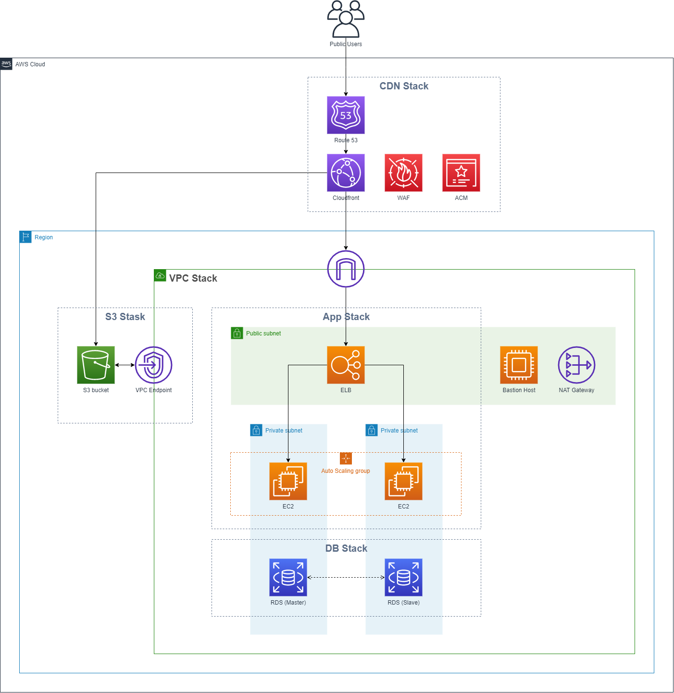

# AWS HA architecture CDK
This repository means to construct CDK codebased to automate HA architecture deployment on AWS, with common AWS services organized into stacks. All dependecies between stacks are well defined, so you can selectively pick only the useful stacks specifically to your project.

## Get started
Before you can launch CDK stacks, make sure you have following environments installed on your machine.
- Lastest AWS CLI version 2 with aws credentials configured (Ref:https://docs.aws.amazon.com/cli/latest/userguide/cli-configure-quickstart.html)
- Lastest AWS CDK Toolkit (Ref:https://docs.aws.amazon.com/cdk/latest/guide/getting_started.html)
- Python AWS CDK applications require Python 3.6 or later

Once the environments are set up, you can install the required dependencies.

```
$ pip install -r requirements.txt
```

At this point you can now synthesize the CloudFormation template for this code.

```
$ cdk synth
```

To add additional dependencies, for example other CDK libraries, just add
them to your `setup.py` file and rerun the `pip install -r requirements.txt`
command.

### Useful commands

 * `cdk ls`          list all stacks in the app
 * `cdk synth`       emits the synthesized CloudFormation template
 * `cdk deploy`      deploy this stack to your default AWS account/region
 * `cdk diff`        compare deployed stack with current state
 * `cdk docs`        open CDK documentation

The `cdk.json` file tells the CDK Toolkit how to execute your app.

## Architecture

Stack Name | Services | Dependency
------------ | ------------- | -------------
VPC Stack | Subnets, NAT Gateway, Bastion Host | -
App Stack | Application Load-Balancer, Auto-scaling group, EC2 | VPC Stack
DB Stack | Multi-AZ RDS | VPC Stack
CDN Stack | Cloudfront, ACM, Route 53 | App Stack
S3 Stack | S3 bucket, Gateway VPC Endpoint | VPC Stack

This architecture contains multiple stacks that you can selectively deploy based on your project needs. For example, if you only need auto-scaling EC2 and RDS to serve your dynamic application, you can run following command.
```
$ cdk deploy cdk-vpc cdk-app cdk-db
```

## Coming Up
- EBS encryption & Delete on termninate on Bastion host & autoscaling group EC2
- WAFv2 managed rule on Cloudfront

## License
This library is licensed under the Apache 2.0 License.